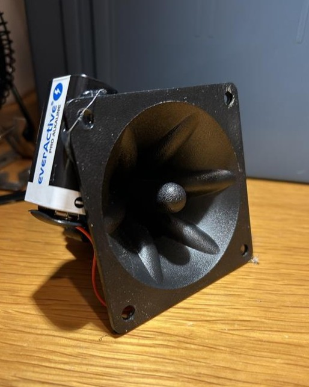

# Portable Canine Silencer

This was a quick weekend project I put together a while ago. It’s not especially practical, but it was fun to build and experiment with.

<!--
<figure style="width: 360px; margin: 0 auto 15px auto; text-align: center;">
  
</figure>
-->

  

  

