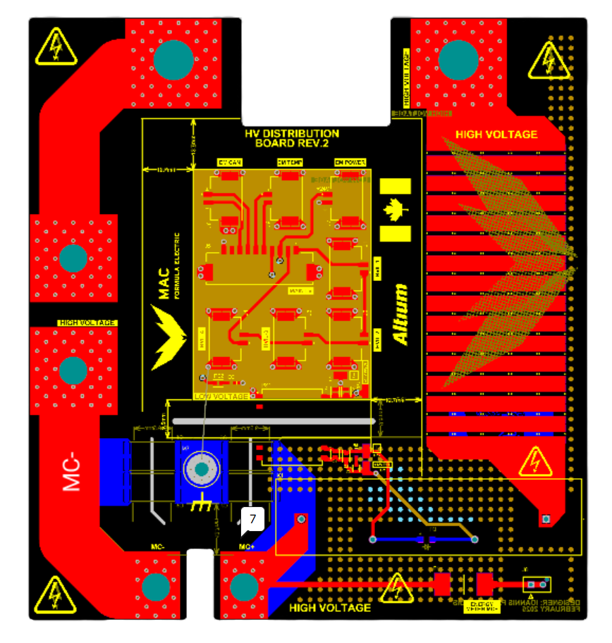
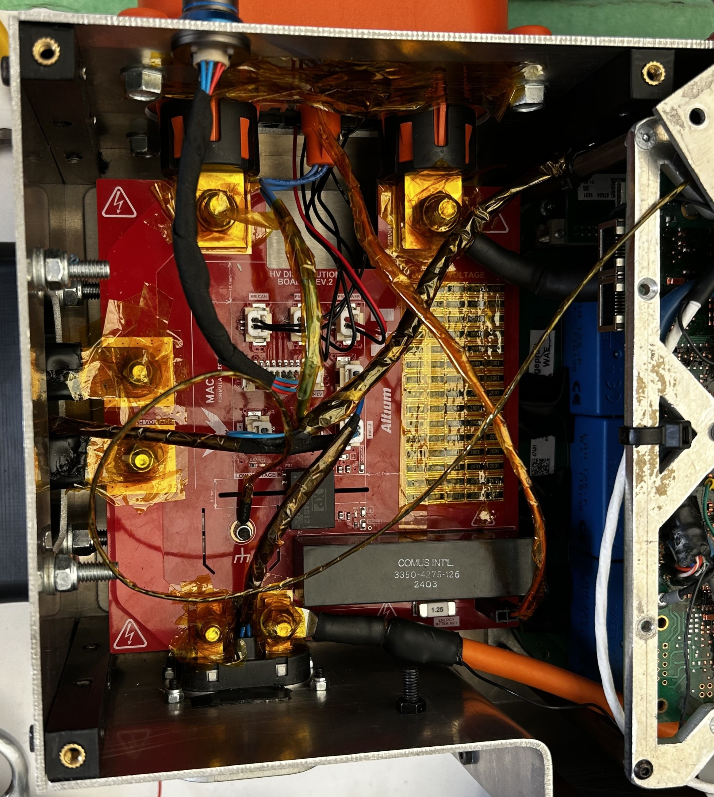
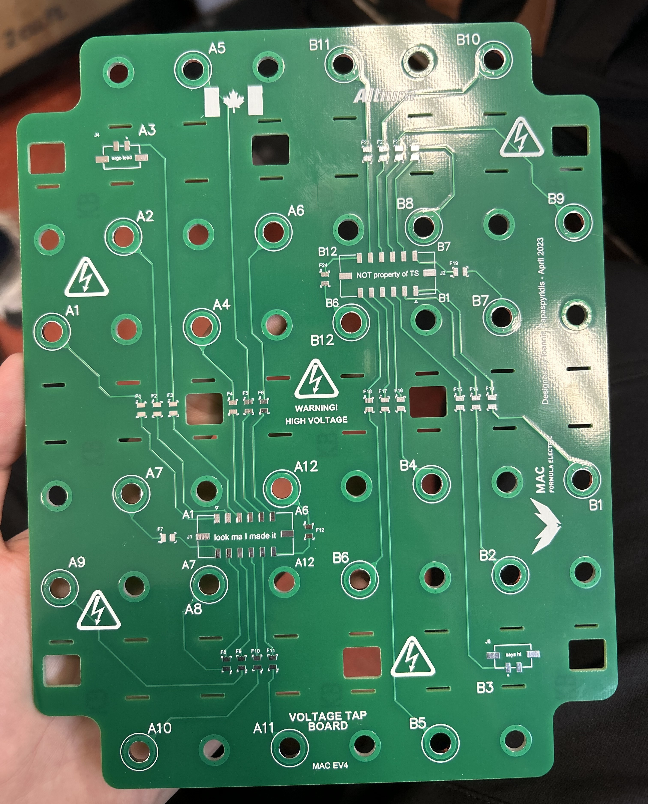

# PCB Designs

## High-Voltage Distribution Board Rev 2 (HVD-R2)
This is a PCB I designed for McMaster's FSAE Electric design team - [Mac Formula Electric](https://macformularacing.com/), during Winter 2025 using Altium Designer.

<!--
<figure style="width: 360px; margin: 0 auto 15px auto; text-align: center;">
  
</figure>
-->

  

  

It uses a four-layer stackup with 4 oz internal and external copper weight.

This board sits between the high-voltage battery and the inverter, and its main functions are to:

1. Facilitate the high-current path from the battery to the inverter
2. Provide high-current connection points for the energy meter (EM) and manual service disconnect (MSD)
3. Implement discharge for the high-voltage bus
4. Provide LV power to the EM
5. Facilitate high-voltage interlock loop (HVIL) connections for the EM, MSD, inverter, and HVDC connector
6. Provide CM/DM (common mode/differential mode) filtering for the HV bus

The heavy copper weight on all layers is necessary, as it must conduct the full 50–60 A DC of the tractive system to the inverter. This significantly increases manufacturing costs, so it’s not ideal. Bus discharge is implemented using an array of 2 W SMD resistors and a normally-closed (NC) relay, which can discharge the inverter capacitors to <50 V in under 5 seconds, as required by FSAE rules. When the car is in the driving state, the relay coil is powered and the discharge array is disconnected from the bus. In the event of loss of LV power or another fault condition, the relay automatically closes to safely discharge the HV bus. A fast antiparallel diode is placed across the relay’s LV terminals to prevent inductive flyback.

The energy meter and MSD terminals are bolted to the PCB using locknuts. These also serve as the mounting points for the PCB itself, as the MSD and EM are bolted onto the chassis and inverter enclosure, respectively.

The HVIL circuit consists of automotive-qualified connectors placed in series. When all connectors are mated, the HVIL circuit can power the downstream node. The copper weight is completely overkill for this circuit, so the space utilization is fairly poor. In the future, the HVIL portion will be moved off-board to save on board space and cost.

Some rudimentary common-mode filtering was attempted by placing two sets of Y-capacitors across the HV lines to chassis ground. Due to the strict clearance requirements in FSAE, placing them on the board wasn’t trivial and only allowed for relatively small capacitor footprints. The effect of these capacitors was likely negligible, as there was no provision for a direct PCB-to-enclosure connection, and a long, thin wire was used instead. This introduces significant inductance, making the capacitors ineffective for this purpose. In the next iteration, there will be a dedicated mounting point on the metal enclosure for a low-impedance ground connection. Additionally, there was no available space on the board to fit any X-capacitors.

<figure style="width: 560px; margin: 0 auto 15px auto; text-align: center;">
  
  <figcaption style="font-size: 0.9em; color: #aaa;">HVD-R2 integrated into the inverter enclosure</figcaption>
</figure>

Many thanks to [Rahim](https://raziz1.github.io/) for the beautiful renders!

## Voltage Tap Board
This is another PCB I designed for [Mac Formula Electric](https://macformularacing.com/) in Winter 2023 using Altium Designer.

  

  

This is the first PCB I designed completely by myself that was included in the race car (MAC-EV4).
Its function is quite straightforward: it simply “taps” off the positive terminal of each battery module within each segment and provides this voltage to the BMS for sensing each module. There are 144 series modules in the battery, 24 in each segment, each containing 5 cells in parallel, for a total of 720 cells. The BMS only interfaces with each module individually, so it can balance 5 cells at most with 144 taps. Since there are 6 partitions or “segments” in the battery, each PCB is responsible for collecting the voltage of 24 modules, hence the two 12-pin connectors. This also makes this board by far the largest in size among the vehicle PCBs, but not the most expensive due to the simple 2-layer stackup. Each line also needs to be fused, so a small 1 A surface-mount fuse is soldered in series with each voltage line to the BMS.

Since there are 6 segments that make up the HV battery, 6 of these boards are used in the car. Each PCB is placed directly on top of the copper busbars that connect each module in series, so care was taken to prevent any shorts from occurring within the battery. As a result, no traces were routed on the bottom layer (touching the exposed busbars), and the tap traces were spaced as far as possible from live sources. Since the pads do not conduct any current and are simply used for mechanical fastening to the modules, solder mask was applied to cover any exposed copper and ensure good insulation.

In future iterations of this board, its functions were extended to include the series busbar connections for the modules inside the PCB itself. This was done using multiple heavy-weight copper traces, similar to HVD-R2. This also made this PCB the most expensive board in the vehicle, but packaging and assembly of the battery were improved drastically because of this.

<figure style="width: 400px; margin: 0 auto 15px auto; text-align: center;">
  
  <figcaption style="font-size: 0.9em; color: #aaa;">Voltage tap board bare PCB</figcaption>
</figure>